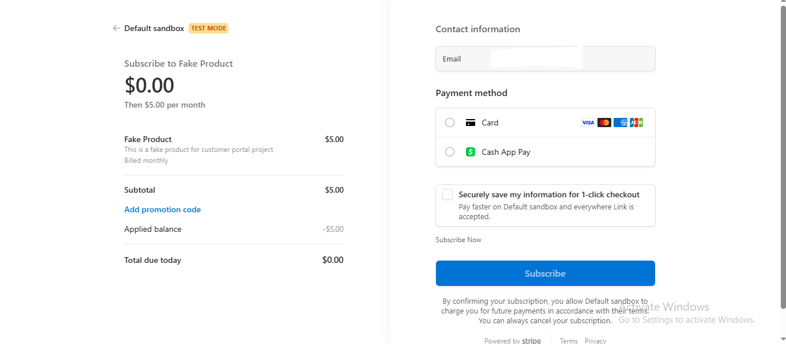

User Subscription using Stripe subscription checkout hosted page (Using Laravel Cashier)

## Table of contents

-   [Overview](#overview)
-   [Steps](#Steps)
-   [Screenshot](#screenshot)
-   [Built with](#built-with)

## Overview

    - Using Laravel jetstream using vue js, Laravel Cashier
    - User subscription functionality uisng stripe's hosted susbcription checkout page.
    - Here user register and login using jetsream functionality and then subscribe using stripe hosted checkout page.
    - Can also upgrade, downgrade, cancel subscription and can also edit billing details.
    - Can customize the checkout page using stripe's dashboard. But for that you need to setup connected accounts.

## Steps

    1. composer install
    2. npm install
    3. Copy .env.example to .env and place your datas and make a stripe account and place you secret key and publishable key and one plan id and all datas place in .env.Also create plans.
    4. Create app key by running the command php artisan key:generate
    5. Run php artisan migrate
    6. Run php artisan db:seed
    7. Run php artisan serve

### Screenshot

Subscription page

Subscribe

Upgrade Subscription

### Built with

-   Laravel
-   Laravel Jetstream
-   Vue Js
-   Laravel Cashier
-   Stripe
